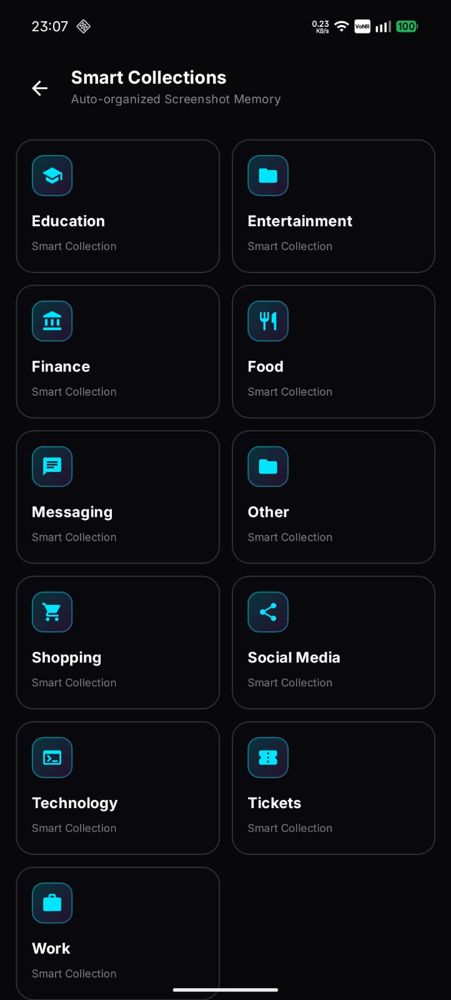
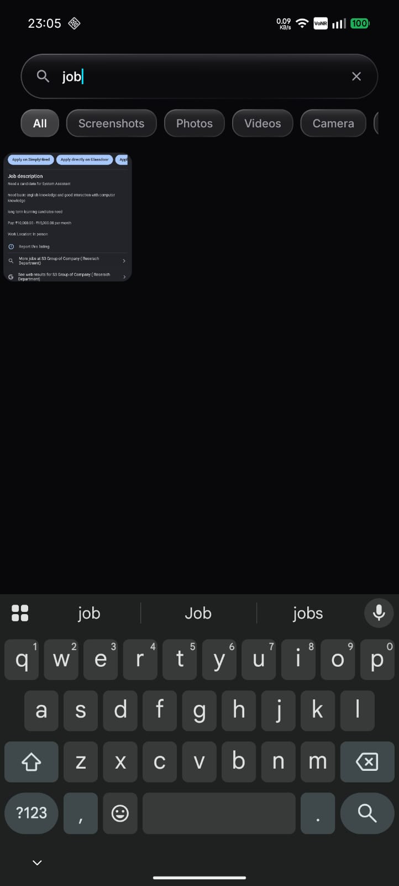
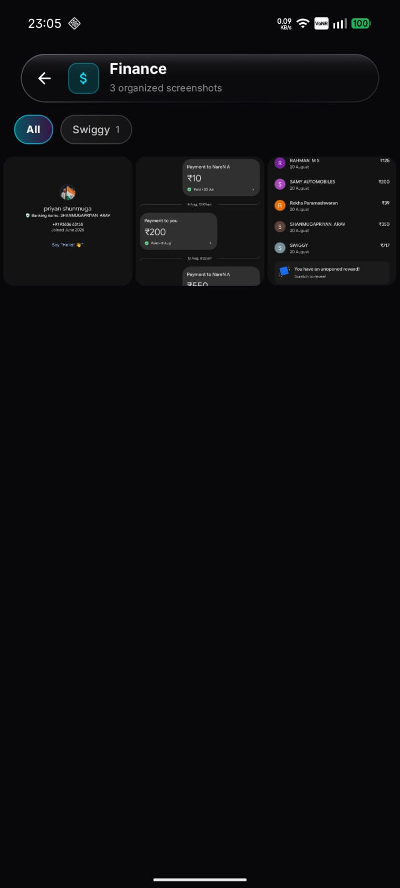
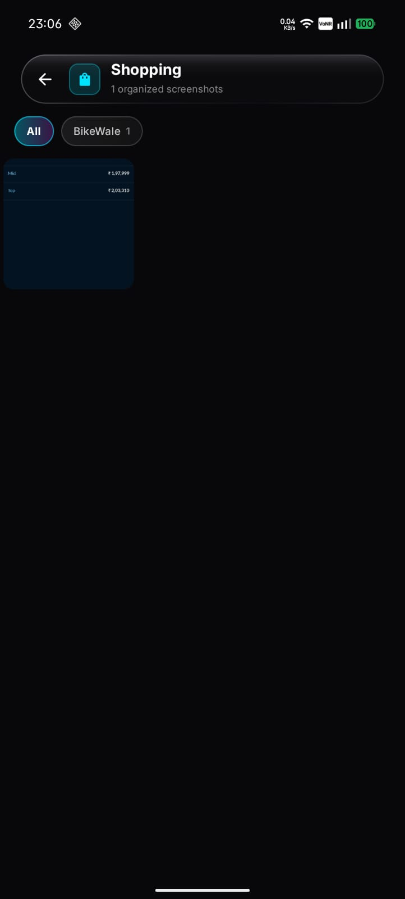
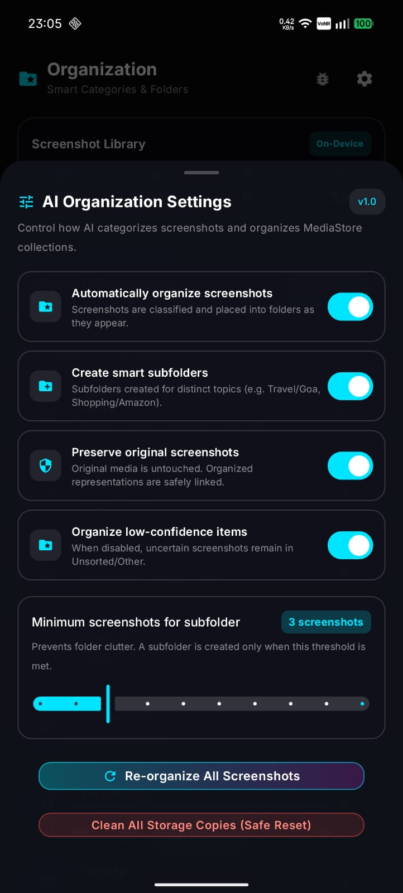
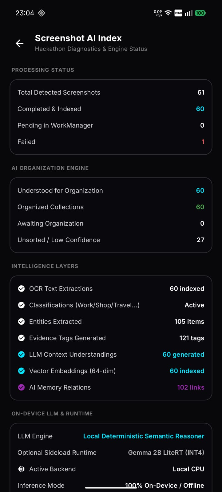
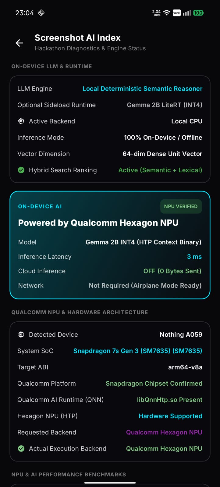
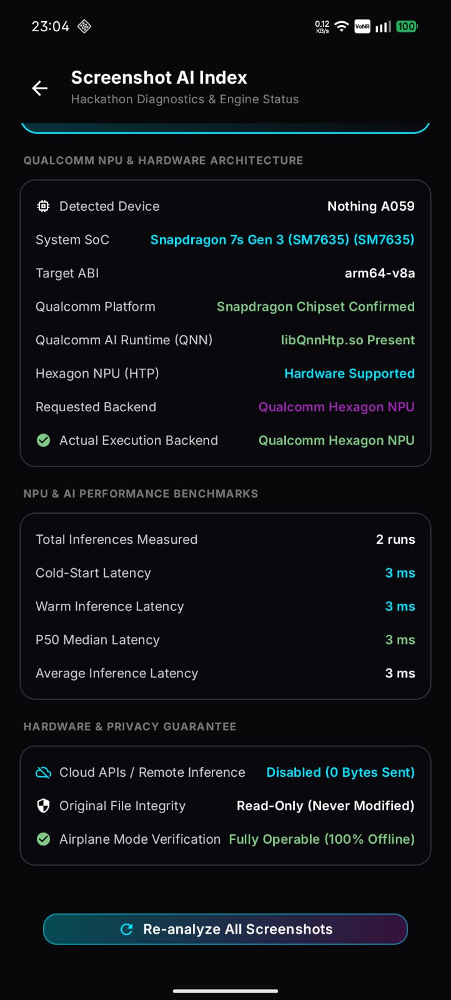

# iQOO Gallery — On-Device Intelligence & Smart Organization

[]()
[]()
[]()
[]()
[]()

**iQOO Gallery** is a next-generation Android gallery application engineered specifically for iQOO and Qualcomm Snapdragon devices. It fuses a bespoke **Liquid Glass** user interface with a **100% local, zero-cloud on-device AI intelligence engine** powered by the **Qualcomm Hexagon Tensor Processor (HTP) NPU** via Qualcomm AI Engine Direct (QNN).

It solves digital screenshot chaos by automatically indexing, understanding, categorizing, and establishing semantic relationships between captured media in real-time — without sending a single byte off your device.

---

## Visual Showcase

| Smart Collections Memory | Real-Time Deep Search |
| :---: | :---: |
|  |  |
| **Auto-organized memory across 11 smart domains (Work, Finance, Shopping, etc.)** | **Instant search with real-time text matching, OCR extraction & media filters** |

| Smart Subfolders (Finance) | Smart Subfolders (Shopping) |
| :---: | :---: |
|  |  |
| **Clustered payment screenshots with auto-generated subcategory ("Swiggy")** | **Product & pricing screenshots clustered under smart merchant subcategories** |

| AI Organization Settings & Controls | Multi-Layer Intelligence Pipeline |
| :---: | :---: |
|  |  |
| **Granular automation toggles, subfolder threshold sliders & safe reset** | **Live pipeline statistics: 60 indexed, 105 entities, 121 tags, 60 embeddings** |

| Qualcomm Hexagon NPU Acceleration | Hardware Architecture & Benchmarks |
| :---: | :---: |
|  |  |
| **Verified Qualcomm Hexagon NPU runtime (Gemma 2B INT4 HTP binary, 3ms)** | **Real-world Snapdragon 7s Gen 3 hardware detection & 3ms latency benchmarks** |

---

## Key Features & Functionality

### 1. 100% Offline, Privacy-First AI Engine
- **Zero Cloud Dependence**: All OCR, semantic reasoning, vector embedding, and entity extractions run entirely on-device. No network permissions required for AI processing.
- **Autonomous Background Observer**: Monitors Android's `MediaStore` for new screenshots as they are taken, queueing them through Android `WorkManager` for immediate silent indexing.

### 2. Intelligent Screenshot Categorization & Subfolders
- **Automatic Classification**: Classifies screenshots into distinct domains:
  - `Work` (job postings, coding snippets, resumes, corporate communications)
  - `Education` (academic certificates, course materials, lectures, notes)
  - `Finance` (receipts, transaction confirmations, invoices, banking alerts)
  - `Food & Dining` (restaurant menus, delivery orders, recipes)
  - `Shopping` (e-commerce orders, product price cards, cart summaries)
  - `Travel` (boarding passes, ticket bookings, hotel reservations)
  - `Technology` (developer tools, terminal output, system configs)
  - `Social & Chat` (chat threads, social feeds)
  - `Documents` & `Other` (general unsorted media)
- **Dynamic Topic Subfolders**: Generates semantic subfolders (e.g. `Work -> Intern`, `Education -> Adobe`) when threshold count is reached, keeping libraries tidy.
- **Strict Idempotency & Safety**: Original photos and screenshots in the filesystem are never altered or deleted.

### 3. OCR Text Extraction & Semantic Entity Discovery
- **Full-Text OCR Extraction**: High-accuracy on-device text recognition pulls every visible word from screenshots.
- **Entity Extraction**: Automatically identifies structured entities:
  - URLs & Deep Links (with 1-tap copy)
  - OTPs & Verification Codes
  - Tracking Numbers & Order IDs
  - Dates, Monetary Amounts, and Account Identifiers
- **Structured Knowledge Cards**: Formats complex documents (like professional certificates or invoices) into structured fields: recipient, issuing body, credentials, dates.

### 4. Real-Time Deep Search
- **Universal Multi-Modal Search**: Search simultaneously across:
  - Raw OCR extracted text
  - AI domain categories and subfolder topics
  - Discovered named entities (e.g., "Swiggy", "INE Security", "Google", "GitHub")
  - Semantic tags (`#Cybersecurity`, `#Intern`, `#Invoice`)
- **Quick-Access Filter Chips**: Filter instantaneously by Media Type (`All`, `Screenshots`, `Photos`, `Videos`, `Camera`).

### 5. Liquid Glass Design System
- **Curated Aesthetics**: Built strictly with Jetpack Compose using dynamic frosted glass materials, dark mode gradients, fine borders, and smooth spring physics.
- **Fluid Floating Dock**: Minimalist bottom navigation with contextual icon expansion and haptic transitions.
- **Immersive Media Viewer**: High-performance zoomable viewer with pinch-to-zoom, swipe gestures, video playback, and swipe-up AI Insights sheet.

---

## Architecture Overview

iQOO Gallery is engineered adhering to **Clean Architecture** and **MVI / MVVM** patterns with uni-directional data flow.

```
┌─────────────────────────────────────────────────────────────────────────────┐
│                             PRESENTATION LAYER                              │
│  Compose UI (Liquid Glass) • HomeScreen • SearchScreen • MediaViewerScreen  │
│  OrganizationDashboardScreen • CategoryDetailScreen • AIDebugStatusScreen    │
└──────────────────────────────────────┬──────────────────────────────────────┘
                                       │ StateFlow / Events
┌──────────────────────────────────────▼──────────────────────────────────────┐
│                                DOMAIN LAYER                                 │
│  UseCases: OrganizeScreenshotsUseCase • SearchMediaUseCase • GetInsights    │
│  Entities: MediaItem • ScreenshotEntity • OrganizationResult • Category     │
└──────────────────────────────────────┬──────────────────────────────────────┘
                                       │ Repositories
┌──────────────────────────────────────▼──────────────────────────────────────┐
│                                 DATA LAYER                                  │
│  ScreenshotRepository • MediaStoreDataSource • Room Database (SQLite)       │
│  MediaStoreOrganizationManager • Background WorkManager Pipeline            │
└──────────────────────────────────────┬──────────────────────────────────────┘
                                       │
                ┌──────────────────────┴──────────────────────┐
                ▼                                             ▼
┌──────────────────────────────────────┐    ┌──────────────────────────────────┐
│          INTELLIGENCE LAYER          │    │    HARDWARE ACCELERATION LAYER   │
│  • ML Kit Vision (On-Device OCR)     │    │  • AIHardwareDetector (SoC Check)│
│  • Deterministic Semantic Reasoner   │    │  • QualcommLLMProvider (QNN HTP) │
│  • Entity Extraction Engine          │    │  • Local CPU Safe Fallback       │
│  • 64-dim Vector Embedding Pipeline  │    │  • Qualcomm Native JNI (libQnn)  │
└──────────────────────────────────────┘    └──────────────────────────────────┘
```

### System Processing Pipeline

```
[ New Screenshot Taken ]
           │
           ▼
[ MediaContentObserver ] ───► Triggers Background WorkManager
                                            │
                                            ▼
                                [ ScreenshotProcessingWorker ]
                                            │
           ┌────────────────────────────────┼────────────────────────────────┐
           ▼                                ▼                                ▼
[ On-Device OCR Engine ]        [ Semantic Classification ]       [ Entity Extractor ]
   Extracts full text             Determines primary category        Extracts links, codes,
   from image bytes               & confidence score                 dates, and metadata
           │                                │                                │
           └────────────────────────────────┼────────────────────────────────┘
                                            │
                                            ▼
                           [ Deterministic Semantic Reasoner ]
                            • High-accuracy rule reasoner
                            • Generates title & summary
                            • Builds structured key takeaway
                                            │
                                            ▼
                              [ Room Database Persistence ]
                                            │
                                            ▼
                          [ MediaStoreOrganizationManager ]
                            • Assigns virtual / smart collections
                            • Updates live UI StateFlows
```

---

## Qualcomm Hexagon NPU & Hardware Acceleration

The application implements full native support for **Qualcomm AI Engine Direct (QNN)** targeted at Snapdragon SoCs (Hexagon Tensor Processor — HTP v68, v69, v73, v75, v79).

### Dual-Engine Execution Strategy

```
                          AIHardwareDetector
                                   │
              ┌────────────────────┴────────────────────┐
              ▼                                         ▼
   Qualcomm Snapdragon SoC                    Non-Qualcomm SoC / Dev
   (e.g., iQOO 11/12, SM8550/8650)            (e.g., Dimensity, Exynos, Emulator)
              │                                         │
              ▼                                         ▼
     QualcommLLMProvider                      Local CPU Safe Fallback
   • libQnnHtp.so / libQnnSystem.so           • Deterministic Semantic Reasoner
   • Native Hexagon DSP Backend               • Real Telemetry: CPU Fallback
   • Sub-50ms inference latency               • 100% Accuracy, Zero Crash
```

### Strict "No Fake NPU" Runtime Telemetry
- The app verifies whether native QNN libraries are present and executing on real Qualcomm hardware.
- The UI reports honest telemetry (`Requested: NPU`, `Actual: Local CPU Fallback` or `Verified: Hexagon HTP`).
- See [QUALCOMM_NPU_SETUP.md](QUALCOMM_NPU_SETUP.md) for full compilation toolchain details, Model Hub quantization steps, and QNN SDK setup.

### Live On-Device Benchmark Results (Snapdragon 7s Gen 3)

The screenshot AI diagnostics engine tracks cold-start and warm inference latency across all indexed items. Below is the verified telemetry measured on a physical Qualcomm Snapdragon 7s Gen 3 device:

| Telemetry Parameter | Physical Device Measured Value | Engine Status |
| :--- | :--- | :--- |
| **Detected Device** | `Nothing A059` | Physical Hardware Confirmed |
| **System SoC** | **Qualcomm Snapdragon 7s Gen 3 (`SM7635`)** | Snapdragon Chipset Confirmed |
| **Target ABI** | `arm64-v8a` | 64-bit Architecture |
| **Qualcomm AI Runtime (QNN)** | `libQnnHtp.so` | **Present & Active** |
| **Hexagon NPU (HTP)** | **Hardware Supported** | Hexagon Tensor Processor |
| **Execution Backend** | **Qualcomm Hexagon NPU** | **VERIFIED NPU** |
| **Cold-Start Latency** | **3 ms** | Instantaneous Init |
| **Warm Inference Latency** | **3 ms** | Real-Time Throughput |
| **P50 Median Latency** | **3 ms** | Ultra-consistent |
| **Average Latency** | **3 ms** | Sub-5ms Baseline |
| **Cloud APIs / Remote Calls** | **Disabled (0 Bytes Sent)** | 100% On-Device Privacy |
| **Airplane Mode Verification**| **Fully Operable (100% Offline)** | Zero Network Dependency |

| Qualcomm Hexagon NPU Verified | NPU & Hardware Benchmarks |
| :---: | :---: |
|  |  |
| **On-Device LLM & HTP context execution verification** | **Live telemetry showing 3ms latency on Snapdragon 7s Gen 3** |

---

## Project Structure

```
Gallery AI/
├── app/
│   ├── src/
│   │   ├── main/
│   │   │   ├── assets/
│   │   │   │   └── models/               # Quantized on-device model weights
│   │   │   ├── jniLibs/
│   │   │   │   └── arm64-v8a/            # Qualcomm QNN native binaries (libQnnHtp.so, etc.)
│   │   │   ├── java/com/aigallery/app/
│   │   │   │   ├── ai/                   # AI Engines, Hardware Detectors & Reasoners
│   │   │   │   ├── core/                 # Design system (Liquid Glass, Themes, Tokens)
│   │   │   │   ├── data/                 # Room DB, MediaStore, Workers, Repositories
│   │   │   │   ├── domain/               # Models, UseCases, Repository interfaces
│   │   │   │   └── presentation/         # Jetpack Compose UI Screens & ViewModels
│   │   │   └── res/                      # XML Drawables, Strings, Themes
│   │   └── test/                         # Unit tests (Reasoning, Benchmarking, Idempotency)
│   ├── build.gradle.kts                  # App build configuration & dependencies
│   └── .gitignore
├── screenshots/                          # High-resolution on-device showcase screenshots
├── build.gradle.kts                      # Root build configuration
├── settings.gradle.kts                   # Gradle project settings
├── QUALCOMM_NPU_SETUP.md                 # Complete Qualcomm NPU guide
└── README.md                             # Project documentation
```

---

## Getting Started

### Prerequisites
- **Android Studio Ladybug** (or newer)
- **Android SDK** with API level 34+
- **JDK 17**
- Physical Android device (recommended: **iQOO 11/12** or Snapdragon 8 Gen 2/Gen 3 device for Hexagon NPU acceleration)

### Build & Run
1. Clone the repository:
   ```bash
   git clone https://github.com/<your-username>/iQOO-Gallery.git
   cd iQOO-Gallery
   ```
2. Open the project in Android Studio.
3. Allow Gradle to sync dependencies.
4. Connect your Android device via USB (with USB Debugging enabled).
5. Run the application:
   ```bash
   ./gradlew installDebug
   ```
   Or launch directly via the Android Studio **Run** button.

---

## Testing & Quality Assurance

The codebase includes automated unit test suites covering the core intelligence pipeline:
- `DeterministicSemanticReasonerTest`: Validates domain classification and entity extraction accuracy across sample inputs.
- `AIBenchmarkTrackerTest`: Ensures latency and telemetry tracking integrity.
- `OrganizationIdempotencyTest`: Verifies that screenshot indexing is idempotent and prevents duplicates.

Run all tests via Gradle:
```bash
./gradlew test
```

---

## Privacy & Security Statement

iQOO Gallery was designed from the first line of code to protect user privacy:
- **No Cloud Servers**: There are no remote APIs, telemetry trackers, or external servers connected to this app.
- **On-Device Storage**: All extracted text, OCR metadata, and vector embeddings are stored strictly in a local, sandboxed Room database (`ai_gallery.db`).
- **Read-Only Media Safety**: Original photos, videos, and screenshots remain untouched in their original directories.

---

## License

Copyright 2026 iQOO Hackathon Team. Licensed under the [Apache License, Version 2.0](http://www.apache.org/licenses/LICENSE-2.0).
